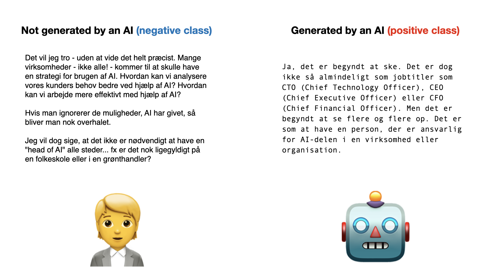

# AI Text Detector

In this use case, you will be receiving 1956 text strings of varying length. Your task is to predict whether or not the text is generated by an AI. See the image below for an illustration of the concept.

<p align="center">
  
</p>

You will receive the 1956 strings as a list of strings. You should return a list of integers in {0, 1} corresponding to a prediction of whether or not the text was generated by an AI.

## Evaluation

To measure the performance of your model, [accuracy](https://scikit-learn.org/stable/modules/generated/sklearn.metrics.accuracy_score.html) is used. During the week of competition, you will be able to validate your solution against a validation set consisting of 1133 different strings. The best score your model achieves on the validation set will be displayed on the scoreboard.

Once you are ready with your final model, you can submit it **once** and have it evaluated on the 1956 text strings. We encourage you to check your code and API before you submit your final model. You can find the documentation of your API where you can try out your model and verify the prediction. The documentation is by default found at `0.0.0.0:4242/docs`, and then find the prediction endpoint for the use case.

**Note that the request times out after 60 seconds, so make sure your solution can handle 2000 reviews in under 60 seconds.**

After evaluation, your final score will be provided. This score can be seen on the scoreboard shortly after.

## Getting started using Emily
Once the repository is cloned, navigate to the folder using a terminal and type:
```
emily open ai-text-detector
```

A Docker container with a Python environment will be opened. Some content needs to be downloaded the first time a project is opened, this might take a bit of time.

A dummy response has been created in router.py. The prediction uses the DTOs from `models/dtos.py`, to ensure that the request and response have the correct format. To take full advantage of Emily and the template, your code for the moves should go in here:

```
@router.post('/predict', response_model=PredictResponseDto)
def predict_endpoint(request: PredictRequestDto):
    class_ids = []
    for answer in request.answers:
        class_ids.append(random.randint(0,1))

    response = PredictResponseDto(
        class_ids=class_ids
    )

    return response
```

You can add new packages to the Python environment by adding the names of the packages to requirements.txt and restarting the project, or by using pip install on a terminal within the container which will result in the package being installed temporarily i.e. it is not installed if the project is restarted. <a href="https://emily.ambolt.io/docs/latest">Click here</a> to visit the Emily documentation.

## Submission
When you are ready for submission, <a href="https://emily.ambolt.io/docs/v3.0.5/guides/deploy-your-api">click here</a> for instructions on how to deploy with Emily. Then, head over to the <a href="https://cases.dmiai.dk/ai-text-detector">Submission Form</a> and submit your model by providing the host address for your API and the API key we have provided to you. Make sure that you have tested your connection to the API before you submit!<br>