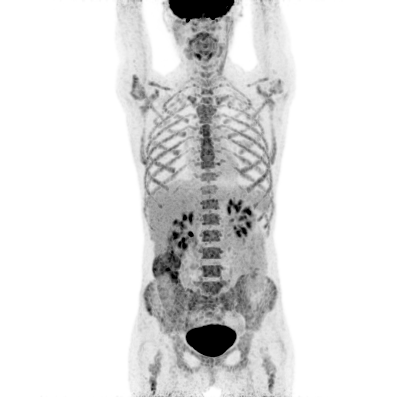

# Tumor Segmentation
In this use case, your task is to detect tumors on medical images.

You will be receiving so-called "Whole-body MIP-PET" images of patients with cancer (see the [MIP-PET section](#mip-pet) for more information). Your job is to segment the tumorours areas in each patient image, i.e. for each pixel in an image, your must determine whether the pixel belongs to a tumor area or a healthy area. You will receive 182 MIP-PET images and ground truth segmentations of patients with cancer (```data/patients```). In addition, you will also receive 426 MIP-PET images of "healthy controls" that have NO cancer (```data/controls```). Your segmentations will be scored via the [Sørensen-Dice coefficient](https://en.wikipedia.org/wiki/S%C3%B8rensen%E2%80%93Dice_coefficient) which is in the range [0-1], with 1 being the best:

$$
dice=\frac{2 \cdot TP }{2 \cdot TP +FP+FN}
$$
$$
\begin{aligned}
&TP\:(\text{True Positive}): &\text{Number of correctly predicted tumor pixels}\\
&FP\:(\text{True Positive})+FN\:(\text{True Positive}):& \text{Number of incorrectly predicted pixels}\\
\end{aligned}
$$

See below for an example segmentation prediction and dice score. 

<p align="center">
  
</p>

Automated tumor segmentation is expected to become a vital tool in the treatment and diagnosis of cancer. Without an automated tool, the clinicians are left to do the segmentation manually, which is costly in terms of time and resources. 

## Evaluation
Both the validation set and the test set each contain 100 samples of patients with cancer. **There are no healthy controls in the validation or test set**.
The images have a maximum width of 400 px and a maximum height of 991 pixels. **You have 10 seconds to return your predictions for each image.**
During the week of the competition, you will be able to validate your solution against the validation set. You can do this multiple times, however, **you can only submit to the test/evaluation set once!** The best validation and test score your model achieves will be displayed on the <a href="https://cases.dmiai.dk/teams"> scoreboard</a> . We encourage you to validate your code and API before you submit your final model to evaluation. 

## Segmentation format
Your model is expected to return a segmentation in the form of an rgb image with only white (255,255,255) and black (0,0,0) pixels. White pixels indicate tumor areas wheras black pixels indicate healthy areas. The segmentation image should have the same shape as the input MIP-PET image. The python function ```validate_segmentation``` in ```utils.py``` will help you check if your segmentation prediction is valid.

## Baseline model
We have implemented a simple threshold baseline model in ```router.py``` along with the boilerplate code needed to deploy the model as an endpoint: 

```python
...
def predict(img: np.ndarray) -> np.ndarray:
    logger.info(f'Recieved image: {img.shape}')
    threshold = 50
    segmentation = get_threshold_segmentation(img,threshold)
    return segmentation

def get_threshold_segmentation(img:np.ndarray, threshold:int) -> np.ndarray:
    return (img < threshold).astype(np.uint8)*255

    
```
To use your own model, simply change the call to ```get_threshold_segmentation``` with a call to the inference function of your model. You can visualize the model output for some patient data via the script ```test_fun.py```. 

To serve the model as a FastAPI endpoint, open a a terminal in the ```tumor_segmentation``` directory and run: 

```
uvicorn api:app
```

To make the endpoint available to the validation service, you can deploy the app to a cloud provider such as Azure. You can do this yourself or use the Emily tool to help you with deployment.

## Getting started using Emily
Once the repository is cloned, navigate to the folder using a terminal and type:
```
emily open tumor_segmentation
```
You will be prompted for selecting an application. Please note, that you need to select a Computer Vision image, if you want to use opencv. Afterwards you can select your prefered deep learning framework. Then select an editor of your choice to open the Emily template for the use case. A Docker container with a Python environment will be opened. Some content needs to be downloaded the first time a project is opened, this might take a bit of time. You can mount a folder with data to your project using the ```emily mount``` command.

A baseline prediction endpoint has been created in ```router.py```. The prediction uses the DTOs from ```models/dtos.py```, to ensure that the request and response have the correct format. 

You can add new packages to the Python environment by adding the names of the packages to requirements.txt and restarting the project, or by using pip install on a terminal within the container which will result in the package being installed temporarily i.e. it is not installed if the project is restarted. <a href="https://emily.ambolt.io/docs/latest">Click here</a> to visit the Emily documentation.

## Submission
When you are ready for submission, <a href="https://emily.ambolt.io/docs/v3.0.5/guides/deploy-your-api">click here</a> for instructions on how to deploy with Emily. Then, head over to the <a href="https://cases.dmiai.dk/tumor-segmentation">Submission Form</a> and submit your model by providing the host address for your API and the API key we have provided to you. Make sure that you have tested your connection to the API before you submit!<br>


## MIP-PET
MIP-PET is short for Maximum-Intensity-Projected Positron Emission Tomography. Positron Emission Tomography (PET) is a medical imaging modality often used for diagnosing and monitoring cancer patients. By scanning a person in a PET-scanner you obtain a volumetric image, which is an image that has three dimensions. Each pixel value in this 3D image reflects, roughly, how much sugar is consumed in that particular part of the body. Since tumors have a high growth rate, they require a lot sugar, and the corresponding pixels thus attain high pixel values in the PET image. Working with 3D images requires a lot of memory, so to reduce the data dimensionality a 2D Maximum Intensity Projected (MIP) can be created by doing a "max"-operation along one dimension of the PET image:

```
mip_pet = np.max(pet,axis=1)
```

Intuitively, the MIP operation on PET images can be imagined visually as shining a light through a semi-transparent patient and recording the shadow on the other side (the patient opacity is determined by the sugar consumption).  

You can read more about PET on [wikipedia](https://en.wikipedia.org/wiki/Positron_emission_tomography).

## Interpreting MIP-PET

Note that some areas of the body will have high sugar consumption even if there is no cancer. 
The following organs have high sugar consumption:
- Brain
- Bladder
- Kidneys
- Hear
- Liver

Some patient factors can lead to increased sugar consumption in parts of the body. Common factors are:
- Constipation
- Forgetting to fast before the scan
- Recent chemotherapy or surgery
- Being cold during the scan

Consequently, it can be difficult to determine whether an area of high sugar uptake is caused by cancer or something else. Here are a few examples of healthy controls that exhibit tricky sugar consumption which could be misinterpreted as cancer. Also note how the brain, bladder, heart, and kidneys almost always have a high sugar uptake.


<table>
  <tr>
    <td>   </td>
    <td>  <h3>Control 50</h3> <p>Symmetric high sugar consumption around neck and esophagus (spiserør) usually caused by the patient being too cold during the scan.</p></td>
   </tr> 
  <tr>
    <td>   </td>
    <td>  <h3>Control 399</h3> <p>Uniform high sugar consumption in the bones usually caused by recent chemotherapy or other treatment.
</p></td>
   </tr> 
    <tr>
    <td>   </td>
    <td>  <h3>Control 381</h3> <p>Slightly increased sugar consumption in the upper body muscles usually caused by the subject forgetting to fast before the scan.
</p></td>
   </tr> 
    <tr>
    <td>   </td>
    <td>  <h3>Control 398</h3> <p>High sugar consumption in the colon (tyktarm) usually caused by constipation.
</p></td>
   </tr> 
</table>


